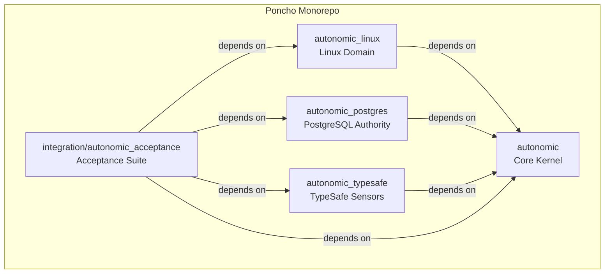

# Poncho Monorepo Migration Guide

This document details the architectural migration of **Autonomic** from an Elixir umbrella project into a **Hex-ready Poncho-style monorepo** containing four independently publishable packages and a dedicated integration test suite.

---

## 1. Executive Summary & Rationale

Prior to this migration, Autonomic was structured as an Elixir umbrella application (`apps_path: "apps"`) with four member applications:
- `apps/autonomic_kernel`
- `apps/autonomic_linux`
- `apps/autonomic_store`
- `apps/autonomic_typesafe`

### The Umbrella Problem for Hex Publishing

While Mix umbrellas provide convenient development co-location, they introduce fundamental architectural limitations when the goal is to publish modular, decoupled packages to [Hex.pm](https://hex.pm):

1. **Shared Build and Dependency Coupling**: Umbrellas share a single root `mix.lock` and build artifacts under `_build/`. This masks circular and accidental dependencies between applications.
2. **`in_umbrella: true` Is Forbidden on Hex**: Hex packages cannot declare `in_umbrella: true` or relative `path:` dependencies. Any package published to Hex must declare real, versioned Hex dependencies (`~> x.y`).
3. **Monolithic Release Cycle**: In an umbrella, bumping a version or changing a dependency can force unnecessary re-releases of unrelated applications.
4. **Enforced Dependency Inversion**: In an umbrella, adapter applications (e.g., store) easily pull in test-only dependencies on other adapters (e.g., linux, typesafe) to satisfy end-to-end integration tests, corrupting package boundaries.

### The Poncho Solution

A **Poncho Monorepo** solves these problems:
- Each package in `packages/` is a completely independent Mix project with its own `mix.exs`, `mix.lock`, test suite, docs configuration, and changelog.
- Development uses relative path dependencies (`{:autonomic, path: "../autonomic"}`).
- Release staging deterministically rewrites path dependencies into versioned Hex dependencies (`{:autonomic, "~> 0.1.0"}`) during packaging.
- Cross-adapter end-to-end integration tests live in `integration/autonomic_acceptance`, cleanly isolating the published packages from cross-cutting test fixtures.

---

## 2. Monorepo Structure and Mappings

```
autonomic/
├── packages/
│   ├── autonomic/                 # Formerly apps/autonomic_kernel (Core OTP Control Plane)
│   ├── autonomic_linux/           # Formerly apps/autonomic_linux (Linux Isolation & Rust Launcher)
│   ├── autonomic_postgres/        # Formerly apps/autonomic_store (PostgreSQL Authority Governor)
│   └── autonomic_typesafe/        # Formerly apps/autonomic_typesafe (TypeSafe Semantic Sensors)
├── integration/
│   └── autonomic_acceptance/      # Cross-package end-to-end integration test suite
├── scripts/
│   ├── release.py                 # Deterministic release staging & inspection pipeline
│   ├── release                    # Executable release runner wrapper
│   ├── lint_package_boundaries.py # Architectural boundary verification tool
│   ├── qc.py                      # Monorepo test & quality control orchestrator
│   ├── qc                         # Executable QC runner wrapper
│   ├── build_launcher.sh          # Native Rust launcher compilation & install script
│   ├── preflight.sh               # Host capability checker
│   ├── run_reference.sh           # Acceptance reference suite runner
│   └── run_db_outage_gate.sh      # Database outage fault-injection gate
├── docs/                          # Architectural, security, and operational documentation
├── artifacts/                     # Machine-readable manifests and reports
└── assets/                        # Shared visual branding (autonomic.svg)
```

### Directory and Identity Mapping

| Old Umbrella Path | New Poncho Path | OTP Application | Hex Package Name | Role |
| :--- | :--- | :--- | :--- | :--- |
| `apps/autonomic_kernel` | `packages/autonomic` | `:autonomic` | `autonomic` | Core control plane, homeostat, effect broker |
| `apps/autonomic_linux` | `packages/autonomic_linux` | `:autonomic_linux` | `autonomic_linux` | Cgroup v2, namespace, seccomp sandbox |
| `native/autonomic_launcher` | `packages/autonomic_linux/native/autonomic_launcher` | N/A (Rust binary) | Bundled in package | Native privileged launcher binary |
| `apps/autonomic_store` | `packages/autonomic_postgres` | `:autonomic_postgres` | `autonomic_postgres` | PostgreSQL Ecto repo, epoch fencing |
| `apps/autonomic_typesafe` | `packages/autonomic_typesafe` | `:autonomic_typesafe` | `autonomic_typesafe` | Semantic sensor bank, drift evaluation |
| Cross-app tests | `integration/autonomic_acceptance` | `:autonomic_acceptance` | Unreleased (internal) | Multi-adapter end-to-end reference tests |

---

## 3. Dependency Graph & Boundary Guarantees



### Invariants Enforced by `scripts/lint_package_boundaries.py`

1. **`autonomic` (Core)**:
   - Does NOT depend on `autonomic_linux`, `autonomic_postgres`, or `autonomic_typesafe`.
   - Free from external DB drivers (Postgrex/Ecto) and native OS isolation logic.
2. **`autonomic_linux`**:
   - Depends only on `autonomic`.
   - Does NOT depend on `autonomic_postgres` or `autonomic_typesafe`.
3. **`autonomic_postgres`**:
   - Depends only on `autonomic`, `ecto_sql`, and `postgrex`.
   - Does NOT depend on `autonomic_linux` or `autonomic_typesafe`.
4. **`autonomic_typesafe`**:
   - Depends only on `autonomic` and `typesafe_sdk`.
   - Does NOT depend on `autonomic_linux` or `autonomic_postgres`.
5. **No `in_umbrella: true`**:
   - Zero occurrences in any `mix.exs` or codebase file.

---

## 4. Release Staging Pipeline (`scripts/release`)

Because Mix/Hex forbids relative `path:` dependencies when running `mix hex.build` or `mix hex.publish`, Autonomic uses a repository-owned staging tool:


### Topological Publish Sequence

When publishing releases to Hex.pm:
```bash
./scripts/release stage 0.1.0
./scripts/release build 0.1.0
./scripts/release inspect 0.1.0

# When authorized:
# 1. autonomic
# 2. autonomic_linux
# 3. autonomic_postgres
# 4. autonomic_typesafe
```

---

## 5. Development Workflows

### Running All Quality Checks
```bash
# Run full QC across monorepo in handoff mode:
./scripts/qc --handoff

# Run strict release gating (all mandatory gates must pass):
./scripts/qc --strict
```

### Testing a Single Package
```bash
cd packages/autonomic && mix test
cd packages/autonomic_linux && mix test
cd packages/autonomic_postgres && mix test
cd packages/autonomic_typesafe && mix test
```

### Running Acceptance Suite
```bash
cd integration/autonomic_acceptance && mix test
```

## Independent installation verification

Run `uv run --no-project python scripts/verify_packages.py` to rebuild and inspect
all four tarballs, unpack them outside the checkout, resolve dependencies, compile,
run package tests and build docs. A temporary signed local Hex registry supplies
the unpublished core. Only its `repo:` is changed in disposable verification copies;
version requirements and distributable tarballs are unchanged. Hex configuration
and signing keys are temporary. No publication or credentials are required.

`stage VERSION` takes the current core version and rejects mismatches; adapter
versions stay as declared in their own Mix files, allowing independent patch releases.
Build and inspect always regenerate staging from current source. The SDK development
path override is removed from staged packages. `qc --handoff` allows unavailable
external gates, but any executed failure returns nonzero.

## Tags and future publication

Use package-specific tags: `autonomic-v0.1.0`, `autonomic_linux-v0.1.0`,
`autonomic_postgres-v0.1.0`, and `autonomic_typesafe-v0.1.0`. An adapter patch
can advance independently; adapters initially require core `~> 0.1.0`. A breaking
core 0.2 release requires explicitly compatible adapter requirements/releases.
ExDoc source references use these package tags.

The tagged `release-dry-run.yml` workflow verifies the tag's commit and package
version, requires strict full-system QC on the provisioned privileged runner,
verifies isolated installations, and uploads inspected tarballs. A missing runner
or failed gate blocks the rehearsal. It does not publish and has no Hex credentials.

A future explicit publication workflow must consume the candidates from that exact
verified commit, require an owner-approved protected release environment, and
publish the core first. Only after Hex confirms the core version exists may it
publish Linux, PostgreSQL, and TypeSafe (in that order). For an independent adapter
patch, verify its compatible core is already published. Never overwrite a published
version; stop on partial publication, record successful versions, and resume only
unpublished candidates after verification. Keep credentials in that protected
environment; do not add them to source or artifacts. The current `release publish`
command is a dry-run guard and cannot perform publication.
