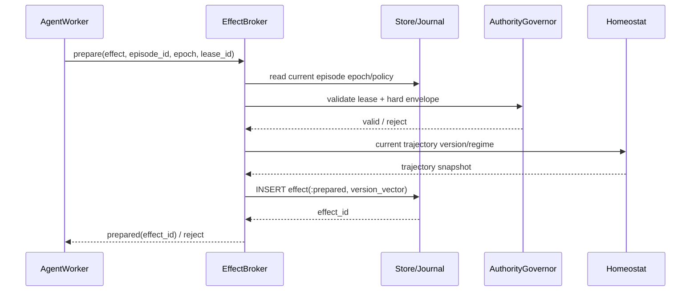

# 04 — Effect Transaction Protocol

## 1. Principle

The worker may **propose** effects. Only the trusted kernel may **commit** them.

This protocol is often described as two-phase commit, but it is not a claim that arbitrary external APIs participate in a distributed database transaction. The two kernel phases are:

1. **Prepare/evaluate** — establish a durable effect proposal and collect authorization bound to an exact version vector.
2. **Commit** — revalidate all authority at the commit horizon, durably record commit intent, then invoke the trusted target adapter.

For targets without idempotency or reconciliation, exactly-once execution is impossible. The protocol represents uncertainty explicitly as `:commit_unknown` instead of unsafe automatic retry.

## 2. Effect classification taxonomy

### Class 0 — `:class_0_local_replayable`

Criteria:

- no externally visible effect;
- deterministic/replayable or disposable;
- contained entirely within sandbox CPU/memory/read-only inputs.

Examples:

- compile source;
- run unit tests;
- read mounted repository files;
- parse AST;
- compute a diff.

Policy: may execute immediately under current sandbox lease. Logged at coarse granularity; no external broker commit required.

### Class 1 — `:class_1_isolated_mutable`

Criteria:

- mutates only disposable isolated state;
- no direct network/external authority;
- rollback is domain/layer destruction.

Examples:

- edit files in overlay upperdir;
- create local throwaway Git commit;
- install a package from an already-materialized/cache source inside the sandbox;
- launch test daemons confined to the episode cgroup.

Policy: execute speculatively. Checkpoint strategy determines recovery cost.

### Class 2 — `:class_2_external_observable_or_compensatable`

Criteria:

- crosses the sandbox boundary;
- externally observable read or bounded action;
- no durable authoritative mutation, or a known compensation exists and policy explicitly accepts it.

Examples:

- brokered HTTP GET to an allowlisted documentation endpoint;
- package metadata lookup;
- fetching a dependency through a controlled cache/proxy;
- creating an explicitly temporary remote artifact with reliable delete compensation.

Policy: always brokered. May use fast/medium verification if signed policy permits. Direct sockets remain forbidden.

### Class 3 — `:class_3_authoritative_external_mutation`

Criteria:

- mutates an authoritative external repository/system;
- impact is bounded and typically auditable/recoverable, but not purely speculative.

Examples:

- materialize a verified Git commit into the authoritative local repository;
- push a non-protected branch;
- update a ticket;
- create a pull request.

Policy: slow verifier required by default; exact epoch/version revalidation at commit; target-specific preconditions and idempotency/reconciliation required where available.

### Class 4 — `:class_4_irreversible_high_impact`

Criteria: either practically irreversible **or** high-impact enough that compensation is not an adequate safety model.

Examples:

- publish package/release;
- production deployment;
- send external communication whose delivery cannot be recalled;
- destructive infrastructure/database action;
- financial transfer.

Policy: structural yield until all policy-required approvals are present. Default requires slow verifier plus explicit high-precedence approval. Targets without safe idempotency/reconciliation are never auto-retried after ambiguous commit outcome.

## 3. Broker ingress

The untrusted domain has no routable network. It receives a single per-episode Unix-domain socket at a path such as:

```text
/run/autonomic/effect.sock
```

The socket server is owned by the trusted host/kernel. Requests are schema-limited and include:

```json
{
  "protocol": 1,
  "episode_id": "ep_...",
  "epoch": 7,
  "lease_id": "lease_...",
  "request_id": "req_...",
  "kind": "git_authoritative_commit",
  "target": {"repo_ref": "repo_..."},
  "payload_ref": "sha256:..."
}
```

The payload itself is stored/materialized through a bounded channel; arbitrary paths from the worker are never trusted as broker paths.

The broker validates Unix peer identity where supported plus the logical episode/lease/epoch tuple. Peer identity is additional evidence, not a substitute for epoch checking.

## 4. No direct Internet

The Linux domain uses two independent restrictions:

1. network namespace with no routable interface;
2. seccomp policy disallowing AF_INET/AF_INET6/raw socket creation while permitting the required AF_UNIX broker channel.

A semantic classification can never remove either restriction.

Read-only network access is still brokered. The worker asks the broker for an HTTP effect; the broker owns DNS, TLS, credentials, redirect policy, size caps, destination allowlist, and response filtering.

## 5. Prepare sequence



Prepare MUST NOT invoke the mutating external target.

## 6. Evaluate sequence

Evaluation assembles independent evidence:

```text
hard deterministic policy
  + capability lease
  + current Homeostat regime
  + semantic sensor observations
  + slow verifier decision (if required)
  + human approval (if required)
  + target-specific preconditions
```

Every decision is bound to:

```text
(effect_id, effect_revision, episode_id, epoch, policy_version,
 snapshot_ancestry, trajectory_version)
```

If the effect payload/target changes, `effect_revision` increments and old approvals do not apply.

## 7. Commit sequence

```mermaid
sequenceDiagram
    participant W as AgentWorker
    participant B as EffectBroker
    participant S as Store/Journal
    participant H as Homeostat
    participant T as Trusted Effect Adapter
    participant X as External Target

    W->>B: commit(effect_id)
    B->>S: BEGIN + lock episode/effect
    S-->>B: current epoch/policy/effect
    B->>H: read current trajectory version/regime
    H-->>B: current state
    B->>B: semantic MVCC + lease + approvals
    B->>S: effect -> :commit_intent; commit_attempt_id
    S-->>B: COMMIT
    B->>T: commit(effect, idempotency_key)
    T->>X: external mutation
    X-->>T: receipt/result
    T-->>B: committed | failed | unknown
    B->>S: record terminal/unknown state
    B-->>W: result
```

The database transaction ends before the external network mutation; holding a SQL transaction across an arbitrary network call is prohibited.

## 8. Crash window and `commit_unknown`

Dangerous window:

```text
journal says :commit_intent
→ target mutation succeeds
→ BEAM node or adapter dies
→ committed receipt not recorded
```

On recovery the broker MUST NOT simply retry.

Recovery:

1. locate nonterminal `:commit_intent`/`:committing` effects;
2. call target adapter `reconcile/2` using effect id/idempotency key/target facts;
3. if target proves committed → record receipt and `:committed`;
4. if target proves not committed → policy may retry with same idempotency key;
5. if target cannot prove either → mark `:commit_unknown`, quarantine further conflicting effects, require operator/target-specific recovery.

Class 4 adapters should be accepted only if their ambiguity semantics are explicitly documented.

## 9. Epoch invalidation during prepare

If epoch advances after worker sends prepare but before journal insertion:

```text
worker request epoch=9
store current epoch=10
→ broker rejects :stale_authority
```

No effect record is required other than an audit event.

## 10. Epoch invalidation after prepare but before commit

```text
prepared effect epoch=9
containment bumps epoch to 10
transaction marks old prepared effect :stale
worker races commit(epoch=9)
→ broker re-reads current epoch=10
→ reject :stale_authority
```

The rejection remains correct even if the old sandbox process has not yet died.

## 11. Epoch invalidation during commit

Once the broker has durably transitioned to `:commit_intent`, epoch advancement and commit must serialize on the episode/effect control lock.

Two allowed outcomes:

- epoch transaction wins before `:commit_intent` → effect becomes stale; no external actuation;
- commit-intent transaction wins first → the system has crossed the commit horizon; epoch advancement records the in-flight commit and containment waits for its outcome/reconciliation.

Do not design an impossible “cancel arbitrary remote side effect after HTTP request was sent” guarantee.

## 12. Target-specific preconditions

Examples:

### Git authoritative commit

- authoritative repo HEAD equals prepared base ref;
- patch digest equals verified payload;
- target path set is allowed;
- no forbidden fixture/secret paths touched;
- required tests correspond to prepared tree digest.

### Git push

- remote ref still equals expected old OID (`--force-with-lease` semantics, never blind force);
- local commit is already authorized Class 3 effect;
- branch target allowed by signed policy.

### HTTP mutation

- exact scheme/host/port/path/method allowed;
- redirects disabled or re-authorized hop-by-hop;
- body digest/size validated;
- credentials selected by broker from target policy;
- idempotency key used where provider supports it.

## 13. Effect backpressure

EffectBroker exposes pressure to SystemRegulator. When approvals or verifiers are saturated:

- Class 0/1 sandbox computation may continue within budget;
- new Class 2 work may throttle;
- Class 3/4 effects remain `:evaluating` and episode enters `:yielding` if speculative work cannot safely proceed;
- workers must not generate endless speculative mutations while commit capacity is unavailable; Homeostat consumes a bounded speculation budget.
